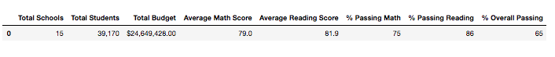
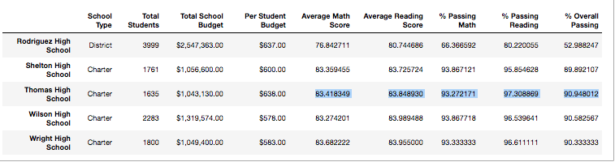
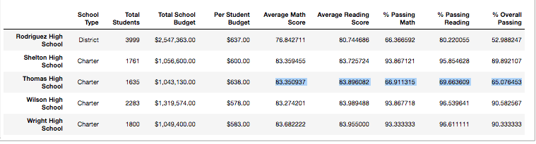

# School_District_Analysis
-----------------------------
## Project Overview

The purpose of this analysis was to assist a client named "Maria" in analyzing data on student funding and standardized test scores for a district of fifteen schools to determine what affects replacing ninth-grade math and reading scores for "Thomas High School" with "NaN" values would have on the district-wide analysis.  The motivation for this replacement procedure was to protect the district-wide analysis from potential misrepresentation considering the ninth-grade students of "Thomas High School" had been suspected of academic dishonesty on their test scores.

To perform the analysis, a variety of metrics were calculated and analyzed for each school prior to the data manipulation experiment.  These included the total number of students, the total budget, the average math scores, average reading scores, the percentage of students that passed math, the percentage of students that passed reading, the percentage of students that passed both math and reading, and the percentage of students who passed overall.  Following this initial analysis, the "Thomas High School" student test scores for math and reading of ninth-graders were replaced with "NaN" values and the same analysis was performed to measure and compare the updated metrics results against the original metrics results.

----------------------------
## Resources

Data Sources:  schools_complete.csv, students_complete.csv

Software:  Python 3.8.3, Visual Studio Code 1.49.2

----------------------------
## Results

### District Summary Affects:

- The affect on the district summary is demonstrated by the following two dataframes.  The first dataframe represents the original summaries of all the district-wide metrics.  The second dataframce represents the summarized metrics following the inclusion of NaN values.  As you can see, the NaN values caused the average math score to drop .1 points, the average reading score to remain the same, the percent passing math to drop by .2, the percent passing reading to drop by .3 and the percent overall passing to drop by .1 points.
 
     

    

### School Summary Affects:

The following image shows the "tail-end" of the school summary dataframe prior to the replacement of ninth-grade data with NaN values:

   

- When the DataFrame included the rows for the 9th graders but their test scores were replaced with NaN values, their percentages for reading, math, and overall passing were in the range of the 60s.  This is because the total students in the data remained at 39,170, just as before the NaN values were introduced, but their values were no longer counted, resulting in a much lower percentage.  This can be seen by the following dataframe screenshot:

    

From this dataframe, in comparison to the original, it is clear the data for Thomas High School test score percentages experienced a drastic reduction as a result of the NaN values.  Although the average math and reading scores remained relatively unchanged, the percent passing math decreased by about 26%, the percent passing reading decreased by 28%, and the overall passing percentage decreased by about 26%.

However, this DataFrame did not adequately represent the rest of the students for Thomas High School.  Hence, a new dataframe was also created for Thomas High School to only include 10th, 11th, and 12th graders.  Once this dataframe was updated to more adequately represent the other grade scores of Thomas High School, the following results were obtained:
   
   

By comparing this result to the original dataframe, the average math score dropped by about 0.1 point and the average reading score remained relatively static.  However, the percent passing math, percent passing reading, and the percent of students overall passing dropped about 1.1 percent points each.

----------------------------

- By replacing Thomas High School's math and reading scores with NaN values for ninth-graders, it appears this had the affect of reducing the scores for Thomas High School.  Of course,  only significantly affected Thomas High School's perfomance results.  In contrast, the overall affect on the district-wide data was of only minor significance comparatively, as the district summary revealed.

--------------------------

## Summary

As a result of the comparative data analysis, the replacement of ninth-grade test scores for "Thomas High School" with NaN values certainly altered the district-wide metrics results.  However, since there were only 461 NaN values replaced in the dataset out of 39,170 total students, the averages and percentages remained relatively representative of the district-wide metrics even after the second analysis.  Thus, it appears the results of the replacement of 461 potentially misrepresentative values with NaN values served well to succesfully safeguarded the datasets from potential misrepresentation.

Four major changes 

Nevertheless, four changes in the updated school district analysis after reading and math scores for the ninth grade at Thomas High School have been replaced with NaNs include the significant decrease
