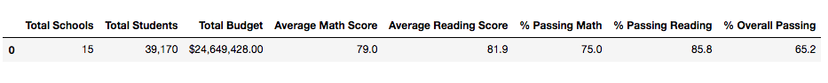

# School_District_Analysis

-----------------------------

## Project Overview

The purpose of this analysis was to assist a client named "Maria" in analyzing data on student funding and standardized test scores for a district of fifteen schools to determine what affects replacing ninth-grade math and reading scores for "Thomas High School" with "NaN" values would have on the district-wide analysis.  The motivation for this replacement procedure was to protect the district-wide analysis from potential misrepresentation, considering the ninth-grade students of "Thomas High School" had been suspected of academic dishonesty on their test scores.

To perform the analysis, a variety of metrics were calculated and analyzed for each school prior to the data manipulation experiment.  These included the total number of students, the total budget, the average math scores, average reading scores, the percentage of students that passed math, the percentage of students that passed reading, the percentage of students that passed both math and reading, and the percentage of students who passed overall.  Following this initial analysis, the "Thomas High School" student test scores for math and reading of ninth-graders were replaced with "NaN" values and the same analysis was performed to measure and compare the updated metrics results against the original metrics results.

----------------------------
## Resources

Data Sources:  schools_complete.csv, students_complete.csv

Software:  Python 3.8.3, Visual Studio Code 1.49.2

----------------------------
## Results

### District Summary Affects:

- The affect on the district summary is demonstrated by the following two dataframes.  The first dataframe represents the original summaries of all the district-wide metrics.  The second dataframce represents the summarized metrics following the inclusion of NaN values.  As you can see, the NaN values caused the average math score to drop .1 points, the average reading score to remain the same, the percent passing math to drop by .2, the percent passing reading to drop by .1, and the percent overall passing to drop by .3 points.
 
     

    

### School Summary Affects:

The following image shows the last five rows of the school summary dataframe prior to the replacement of ninth-grade score data with NaN values for Thomas High School:

   

- When the DataFrame included the rows for the 9th graders but their test scores were replaced with NaN values, their percentages for reading, math, and overall passing were in the range of the 60-70 percent.  This is because the total students in the data remained at 39,170 for this calculation, just as before the NaN values were introduced, but the ninth grade values were no longer counted, resulting in a much lower percentage for Thomas High School in those percentage metrics.  This can be seen by the screenshot below.  In comparison to the original, it is clear the data for Thomas High School test score percentages experienced a drastic reduction as a result of the NaN values.  Although the average math and reading scores remained relatively unchanged, the percent passing math decreased by about 26%, the percent passing reading decreased by 28%, and the overall passing percentage decreased by about 26%.  Of course, the other metrics (budget per student, the number of students etc) were unchanged by the NaN values as they did not represent grades.

    

-However, this DataFrame did not adequately represent the rest of the students for Thomas High School.  Hence, a new dataframe was also created for Thomas High School to only include 10th, 11th, and 12th graders.  Once this dataframe was updated to more adequately represent the other grade scores of Thomas High School, the following results were obtained using the .loc method (see codes and dataframe below).  By comparing this result to the original dataframe, the average math score and average reading score remained relatively unchanged.  The percentage math dropped just about .1 point, the percent reading dropped about 0.3, and the percent overall dropped about 0.3 as well.  It is worth noting, that to calculate the averages, the metric for total students was kept the same even when the calculations were based on tenth, eleventh, and twelfth graders alone for Thomas High School (omitting ninth graders).

   

   
   
   

- Thus, by replacing Thomas High School's math and reading scores with NaN values for ninth-graders, it appears this had the affect of reducing the scores for Thomas High School percentage performance results while leaving the rest of the school data unaffected.  Once a new dataframe was created to only include data for the tenth, eleventh, and twefth grade students of Thomas High School, the percentages were recalibrated and the percentages for Thomas High School became more similar to the rest of the schools.

--------------------------

## Summary

As a result of the comparative data analysis, the replacement of ninth-grade test scores for "Thomas High School" with NaN values certainly altered the metrics results for the district-wide analysis.  These changes occured in multiple categories.  For instance, for the district-wide analysis, the NaN values caused the average math score to drop .1 point, the average reading score to remain the same, the percent passing math to drop by .2 points, the percent passing reading to drop by .1 point, and the percent overall passing to drop by .3 points.  All the changes are indicative that replacing data with NaN values, even for a relatively small subset of a much larger dataset, can have significant affects on the overall results.

Furthermore, with regard to the primary reason for replacing data with NaNs, which was to remediate the concern that the district-wide data could be skewed by ninth grade scores at Thomas High School (since they were suspected of altering their scores), the method was an imperfect, but useful solution.  Since there were only 461 NaN values replaced in the dataset out of 39,170 total students, it did not have a drastic affect on the overall results.  However, it did indeed affect the data measurably and the actual scores for ninth graders are still unknown.  Nevertheless, the process proved an insightful experiment for discerning the affects obtained when utilizing NaN values in attempt to minimize the impact of otherwise potentially misrepresentative data.
